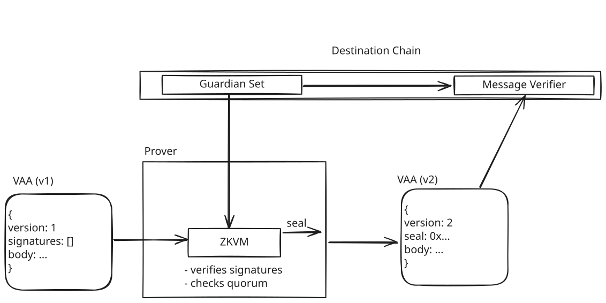

# RISC Zero VAA Verifier

A ZKVM guest program for proving the signature verification of a Wormhole VAA

## Overview

This fork is a demonstration of the simplest way to integrate Risc0 into the existing Wormhole protocol. Alone this gives no benefits and a minor increase in gas costs (~50k gas) per message but unlock the possibilities of:

- Massively reducing the gas costs for relayers by allowing them to compose and verify multiple VAAs in a single proof or even to allow VAA proofs to be composed with other proofs from other protocols. Regardless of how many messages are aggregated the verification costs is constant.
- Use different proofs methods for authorization (e.g. a proof of origin chain light-client finality + transaction inclusion) while using the same on-chain verification logic. This gives a path forward to for upgrading to trust-minimized bridging with minimal changes to the existing protocol while maintaining backward compatibility

Currently verification of RISC Zero proofs is supported on EVM and Solana. This demo only shows EVM integration.

## How it works

This introduces a new field to VAA - `seal`. It also introduces v2 of VAA messages. For v1 messages the seal field is ignored and may be absent. These are the existing wormhole VAAs to maintain backward compatibility. For v2 messages the seal field must be set to a RISC Zero ZKVM [seal](https://dev.risczero.com/terminology#seal) and the signatures field is ignored.

This seal is a crytographic proof that the signatures were verified against a particular guardian set off-chain in the ZKVM. So instead of verifying the signatures when verifying the VAA it is sufficient to verify this proof instead. When verifying the seal the contract must also provide a [journal hash](https://dev.risczero.com/terminology#journal) which commits to the guardian set used and the body of the message.



### Guest Program

In RISC Zero the guest program is the program run inside the ZKVM that a proof is generated for. The main function for the guest program can be found in [this main.rs](./methods/guest/src/main.rs). It just decodes the VAA and guardian set from input, verifies the signatures+quorum, and then commits to the VAA body and guardian set used. Much of this logic is taken directly from the Solana Wormhole contracts.

### Host/CLI Tool

We provide an example [CLI tool](./vaa-prover/src/main.rs) that relayers could use to convert regular VAAs from v1 (with signatures) to v2 (with proofs). This tool could be extended to support aggregation in the future (e.g. multiple messages, single proof). It uses the Bonsai proving service provided by RISC Zero. 

An example of running this tool is:

```shell
BONSAI_API_KEY="<API key here>" BONSAI_API_URL="https://api.bonsai.xyz/" cargo run 01000000000100867b55fec41778414f0683e80a430b766b78801b7070f9198ded5e62f48ac7a44b379a6cf9920e42dbd06c5ebf5ec07a934a00a572aefc201e9f91c33ba766d900000003e800000001000b0000000000000000000000000000000000000000000000000000000000000eee00000000000005390faaaa
```

with output:

```shell
Starting proving of the program
proving complete, encoding VAA-v2
VAA-v2: "020000000004c101b42b11698641b1791a624f1d50fef5711e6a8c15eb478c1dbaa0e9dbced761153a9a0401a9a9c56562c2b3ab5f052d5e189669266af691c148cff37eaff81d2abb4e1ccafaa427ae23fba9862ef468ba209d972ef449733dcf931f3f330f0f7943a81e9a7b59da87ca56d91d57454139b03c4e524a7b1a0f175bf63038de72010ae4207635400aabd7b3205a88e60d721bdd950664e76008d095d2767c227285914e264e0fdb8937fa2aada0bccedaf362587612e29298d951c901053b43053da01c18eec41e57da52c451660d4ca03dbb830346c21f8fec605f267ac5d35e58c48c1ff237dd8300b3684431d642fe10bef07697075e771bbcb92dc694d152b7bc05000003e800000001000b0000000000000000000000000000000000000000000000000000000000000eee00000000000005390faaaa"
```

This example converts a v1 VAA with a single signature from the Solidity tests into a v2 VAA with a proof. In this case the v2 VAA is larger but if the v1 VAA contains the full 19 signatures from the guardian set it will be much larger and the conversion is an effective compression.

> [!IMPORTANT]
> This CLI tool is an example only and doesn't retrieve the current guardian set from on-chain. It currently only supports a single signer

### Contracts

This fork aimed for minimal changes to the on-chain contracts. The main change can be seen in [Messages.sol](../../ethereum/contracts/Messages.sol) which checks for the version of the VM/VAA and uses the correct verification logic in each case. There is also some changes to the [contract state](../../ethereum/contracts/State.sol) which needs to store the hash of the guardian set as well as store the contract address of the RISC Zero verifier. [See the full diff for other changes](https://github.com/wormhole-foundation/wormhole/compare/main...risc0-labs:wormhole:willem/zkvm-vaa).


## Gas Requirements

Gas benchmarking was added for the `parseAndVerifyVM` method in the tests. Results are as follows:

- V1 (13 signers (minimum mainnet quorum)): 146,025
- V1 (19 signers (full mainnet quorum)): 200,549
- V2 : 266,175

This does not account for the additional calldata costs required to submit the signatures/seal. This can be calculated as 16 gas per byte:

- V1 (13 signers (minimum mainnet quorum)): 14,672
- V1 (19 signers (full mainnet quorum)): 21,008
- V2 : 5,152 (r0)

These values combined give a reasonable estimate of the relative costs for submitting a cross-chain message using each method.

Note that for chains where execution is cheap but calldata is expensive (e.g. L2s) V2 messages will likely be cheaper overall.
